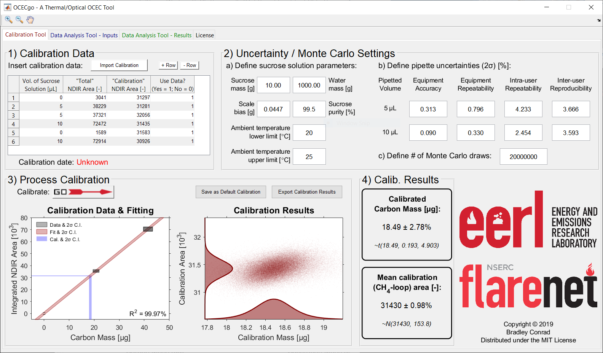

################
Calibration Tool
################

.. contents::
  :depth: 2
  :local:

************
Introduction
************

The *OCECgo* Calibration Tool allows a user to quantify the mass calibration constant and mean calibration area for the OCEC instrument.  The software tool implements a Monte Carlo method to propagate the following uncertainties:

  * Bias in the non-dispersive infrared (NDIR) detector
  * Bias in the concentration of sucrose in the external calibration standard
  * Bias and precision in the pipette used to introduce the external calibration standard to the instrument
  * Confidence in the regression of the uncertain calibration data

*******
Example
*******

Shown below is an example screenshot of the *OCECgo* Calibration Tool.

********************
Instructions for Use
********************

Step-by-step instructions for calibration data input to *OCECgo* are sourced from Protocol Section 4 in Conrad & Johnson [1]_ and are listed below.

.. Note::

  The OCECgo software tool exploits mouseover utilities to aid the user with the input of data and selection of analysis parameters. Further information, including default and permissible ranges for user-editable fields are listed in the tool’s online documentation.

1.  Load the software tool (OCECgo) and click to migrate to the Calibration Tool tab.

  .. :

2.  Input calibration data. In section (1) of the graphical user interface (GUI), input calibration data: nominal volume of the applied sucrose solution, instrument-reported integrated NDIR signal corresponding to total carbon (“total area”), instrument-reported integrated NDIR signal during the CH4-loop (“calibration area”), and a Boolean to indicate whether specific points should be used in calibration (“1” for yes; “0” for no). Repeat for each data point, adding and deleting rows to the table, as necessary, by clicking the “+ Row” and “- Row” buttons.

    .. Note::

      The user can alternatively click the Import Calibration button to upload previous calibration data and inputs to the software tool. If this option is exercised, go to step 4.4 to re-create plots in GUI section (3) or go directly to section 6 to analyze instrument data.

3.  Define uncertainty data for use in the Monte Carlo analysis.

  3.1.  In GUI section (2)(a), input data pertaining to the aqueous sucrose solution. Input masses of sucrose and DDi water measured during step 1.1 and the absolute 2σ bias of the scale [g] used to measure DDi and sucrose masses — absolute bias is equivalent to the scale’s reported accuracy. Input the nominal minimum purity of sucrose [%m/m] listed on the sucrose vessel’s label and insert the range of ambient temperatures [°C] observed during the acquisition of calibration data.

      .. Note::

        2σ corresponds to two times the standard deviation, which in the context of a normal (Gaussian) distribution is a conservative estimate of the 95% confidence interval (CI).

  3.2.  In section (2)(b), provide data pertaining to pipette uncertainty. Input relative 2σ equipment-reported accuracy (bias error), equipment reported repeatability (precision error), precision error corresponding to intra-user repeatability, and bias error corresponding to interuser reproducibility for aspirated volumes of 5 μL and 10 μL.

      .. Note::

        Default pipette uncertainties correspond to the instrument listed in the Table of Materials. Default 2σ human-errors were estimated based on the pooled variances of studies of intra-user repeatability and inter-user reproducibility at each volume.

  3.3.  In section (2)(c), input the desired number of Monte Carlo draws for the computation of calibration metrics.

      .. Note::

        The number of Monte Carlo draws corresponds to the number of random computations of the mass calibration constant under the Monte Carlo framework. Larger numbers yield more accurate and consistent results, at the cost of computational time. The default value in OCECgo is :math:`10^6` while permitted values are :math:`[10^2, 10^8]`.

4.  Run analysis. In GUI section (3), press |go_arrow| to run the Monte Carlo analysis to process calibration data.

  .. :

5.  Update the instrument calibration file with the results presented in section (4). Open the instrument’s parameter file: SCInstrumentParameters.txt. Find the line of text containing the existing calibration data — this line of text includes a comment on the righthand side reading “Calibration Constant…”. Replace the numerical data with the reported “Calibrated Carbon Mass” and “Mean Calibration (CH4-loop) Area”. Save and close the parameter file and re-start the instrument’s software.

  .. :

6.  Save and/or export calibration results (optional).

  6.1.  Click the Save as Default Calibration button to store the calibration result for default use by the software.

      .. note::

        Calibration results are stored in an initialization file that, upon rebooting of the software, reloads the latest calibration. The user is warned if the current date is more than 30 days from the latest calibration.

  6.2.  Click the Export Calibration Results button to export the calibration data.

      .. note::

        Numerical data are exported to a pre-formatted .xlsx file and visualization of the Monte Carlo results are exported as a .png file. This saved calibration file is useful if results are to be reanalyzed/imported at a later date using the applicable calibration.

7.  Once calibration is complete, remove the quartz boat. Following step 2.3.1, remove the quartz insert from the instrument. Using forceps or tweezers, remove the quartz boat used for calibration. Following step 2.5, replace the quartz insert and close the instrument

.. |go_arrow| image:: images/Go_Arrow_Small.png
  :scale: 60 %

************************
Monte Carlo / GUI Inputs
************************

Further descriptions of the GUI inputs and permissible ranges are provided below.

Section 1 - Calibration Data
============================

The software requires a minimum of three calibration data points, at least one of which must be a blank.

.. list-table::
  :widths: 35 65
  :align: center
  :header-rows: 1

  * - Input
    - Description
  * - Vol. of Sucrose Solution [μL]
    - | The volume of sucrose solution introduced into the OCEC instrument (pipetted) for a given data point.
      | Permitted values: {0, 5, 10}
  * - "Total" NDIR Area [-]
    - | The OCEC instrument-reported NDIR area during the analysis phase; reported as "Total area" in the manufacturer's software
      | Permitted values: :math:`\in (-\infty, \infty)`
  * - "Calibration" NDIR Area [-]
    - | The OCEC instrument-reported NDIR area during the CH\ :sub:`4`\ -loop; reported as "Calibration area" in the manufacturer's software
      | Permitted values: :math:`\in (-\infty, \infty)`
  * - Use Data? (Yes = 1; No = 0)
    - | A boolean indicating whether the specific row of data should be used in the Monte Carlo analysis
      | Permitted values: {0, 1}

.. _AnchorToCalibrationMCM:

Section 2 - Uncertainty / Monte Carlo Settings
==============================================

.. list-table::
  :widths: 35 65
  :align: center
  :header-rows: 1

  * - Input
    - Description
  * - Define sucrose solution parameters, Sucrose mass [g]
    - | Mass of sucrose in the aqueous sucrose solution used as external calibration standard
      | Default value: 10.00
      | Permitted values: :math:`\in (0, \infty)`
  * - Define sucrose solution parameters, Water mass [g]
    - | Mass of distilled, de-ionized water in the aqueous sucrose solution used as external calibration standard
      | Default value: 1000.00
      | Permitted values: :math:`\in (0, \infty)`
  * - Define sucrose solution parameters, Scale bias [g]
    - | Absolute bias / accuracy in the scale / balance used to weigh sucrose and water
      | Default value: 0.0447
      | Permitted values: :math:`\in [0, \infty)`
      | Warning if :math:`\lt 0` - automatically defaults to 0
  * - Define sucrose solution parameters, Sucrose purity [%m/m]
    - | Minimum reported purity of sucrose (e.g., typical purities are :math:`\geq 99` or :math:`\geq 99.5`)
      | Default value: 99.5
      | Permitted values: :math:`\in (0, 100]`
      | Warning if :math:`\lt 99`
  * - Define sucrose solution parameters, Ambient temperature lower limit [:math:`^{\circ}C`]
    - | Lower limit of the range of ambient temperature during application of the sucrose solution.
      | Default value: 20
      | Permitted values: :math:`\in (0, 60)`
      | Warning if :math:`\lt 15\ \cup \gt 30`
  * - Define sucrose solution parameters, Ambient temperature upper limit [:math:`^{\circ}C`]
    - | Upper limit of the range of ambient temperature during application of the sucrose solution.
      | Default value: 25
      | Permitted values: :math:`\in (0, 60)`
      | Warning if :math:`\lt 15\ \cup \gt 30`
  * - Define pipette uncertainties, Pipette equipment accuracy
    - | Reported *accuracy* (bias error) of the pipette
      | Default value: 0.313 at 5 μL & 0.090 at 10 μL
      | Permitted values: :math:`\in [0, \infty)`
      | Warning if: :math:`\gt 10`
  * - Define pipette uncertainties, Pipette equipment repeatability
    - | Reported *repeatability* (precision error) of the pipette
      | Default value: 0.796 at 5 μL & 0.330 at 10 μL
      | Permitted values: :math:`\in [0, \infty)`
      | Warning if: :math:`\gt 10`
  * - Define pipette uncertainties, Pipette intra-user repeatability
    - | Human-error *repeatability* (precision error) of the user(s)
      | Default value: 4.233 at 5 μL & 2.454 at 10 μL
      | Permitted values: :math:`\in [0, \infty)`
      | Warning if: :math:`\gt 10`
  * - Define pipette uncertainties, Pipette inter-user reproducibility
    - | Human-error *reproducibility* (bias error) of the user(s)
      | Default value: 3.666 at 5 μL & 3.593 at 10 μL
      | Permitted values: :math:`\in [0, \infty)`
      | Warning if: :math:`\gt 10`
  * - # of Monte Carlo draws [-]
    - | The number of draws (iterations) to be used in the Monte Carlo analysis
      | Default value: :math:`10^6`
      | Permitted values: :math:`\in {10^2 ... 10^8}`
      | Warning if: :math:`\lt 10^2` - Result will be inconsistent, defaults to :math:`10^2`
      | Warning if: :math:`\lt 10^4` - Result may be inconsistent
      | Warning if: :math:`\gt 10^6` - Memory issues and slow processing may result - User can select to continue, stop, or use default :math:`10^6`

.. note::

  If the ambient lower temperature limit exceeds the upper limit, the values are automatically reversed.

**********
References
**********

.. [1] Conrad, B.M. & Johnson, M.R. (2019), Calibration protocol and software for split point analysis and uncertainty quantification of thermal-optical organic/elemental carbon measurements, **J. Vis. Exp.**, 151:e59742 (doi: `10.3791/59742 <https://doi.org/10.3791/59742>`_)
