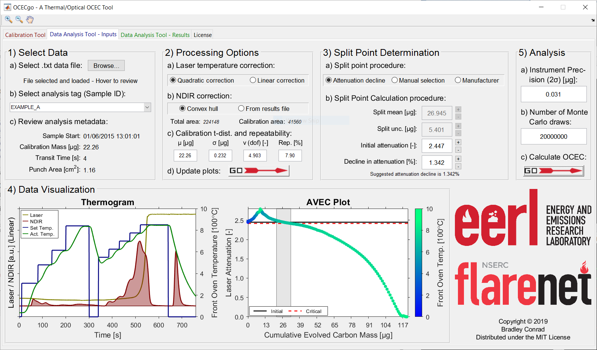
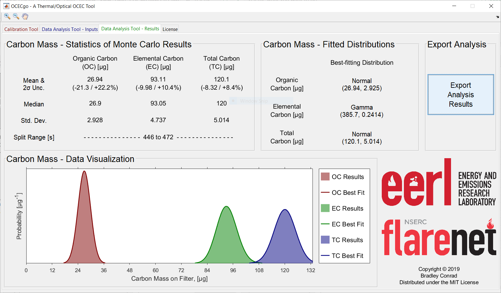

##################
Data Analysis Tool
##################

.. contents::
  :depth: 2
  :local:

************
Introduction
************

The *OCECgo* Data Analysis Tool allows a user to process and visualize measurement data, determine the split point between organic (OC) and elemental (EC), and compute OC, EC, and total carbon (TC) masses and uncertainties.

The software performs the following key procedures:

  * Correction of incident laser power for oven temperature using a user-selectable quadratic or linear fit
  * Correction of drift in the NDIR signal, by a lower-bounded convex hull or by a linear correction using the instrument-reported NDIR areas
  * Standard estimation of the split point using the time-of-transmission approach
  * Estimation of split point uncertainty using a novel *attenuation decline* approach
  * Manual perturbation of the split point and its uncertainty via observation of the analysis' laser attenuation vs. evolved carbon (AVEC [1]_) plot

The software tool implements a Monte Carlo method to propagate the following uncertainties:

  * Uncertainty in the mass calibration constant of the instrument
  * Uncertainty in the split point of the analysis

The software reports:

  * Statistics resulting from the Monte Carlo analysis

    - Average values and :math:`2\sigma` confidence intervals (CIs) for OC, EC, and TC masses
    - Median values for OC, EC, and TC masses
    - Standard devation values for OC, EC, and TC masses
    - Range of split points (in the time domain) corresponding to the :math:`2\sigma` CI

  * Best-fitting distributions for OC, EC, and TC masses corresponding to the Monte Carlo results via Maximum Likelihood Estimation
  * A plot containing histograms and the best-fitting distributions for OC, EC, and TC masses

The software exports:

  * A .xlsx file summarizing input parameters and key numerical results.

  * A .png file displaying the analysis thermogram, AVEC [1]_ plot, and visualization of the Monte Carlo results.

*******
Example
*******

Shown below are example screenshots of the *OCECgo* Data Analysis Tool: the Input and Result pages.

********************
Instructions for Use
********************

Step-by-step instructions for using the OCECgo GUI to analyze data are sourced from Protocol Section 6 in Conrad & Johnson [2]_ and are listed below.

.. Note::

  The OCECgo software tool exploits mouseover utilities to aid the user with the input of data and selection of analysis parameters. Further information, including default and permissible ranges for user-editable fields are listed in the tool’s online documentation.

1.  Load the software tool (OCECgo) and click to migrate to the Data Analysis – Inputs tab.

  .. :

2.  Load time-resolved instrument data — GUI section (1).

  2.1.  In sub-section (a), click the Browse… button and, in the file selection dialog, select the .txt results file defined in step 5.3.1. In sub-section (b), review the Sample IDs (as defined in step 5.3.1), and click to select the analysis of interest. In sub-section (c), review the analysis metadata, particularly the analysis’ Sample Start timestamp.

3.  Define data-processing options — GUI section (2).

  3.1.  In sub-section (a), select the desired laser correction procedure: a quadratic- or linear-dependence on oven temperature.

      .. Note::

        In the experience of the authors, the laser correction procedure typically has a negligible effect ― as such, the quadratic correction is recommended and is loaded as the default value.

  3.2.  In sub-section (b), select the desired NDIR correction procedure: correction via a convex hull to the raw NDIR data or a linear correction using the instrument-reported NDIR areas (From results file).

      .. Note::

        The novel convex hull technique (briefly described in the software’s online documentation) corrects the NDIR signal by fitting a convex hull as a lower-bound to the NDIR time series; this technique allows for a non-linear (piecewise) correction to the NDIR signal. In the experience of the authors, linear correction of the NDIR detector can, in some circumstances, yield non-physical results ― as such, the “Convex Hull” procedure is recommended and is loaded as the default value.

  3.3.  In sub-section (c), if desired, adjust the parameters of the generalized t-distribution reported for the mass calibration constant (calculated in step 4.4) and the estimated calibration repeatability error.

      .. Note::

        Execution of step 4.4 or import of prior calibration results (see step 4.6.2) automatically updates the generalized t-distribution parameters.  Repeatability in instrument calibration (“Rep. [%]”) is set to a default value of 7.90%, based on repeatability testing by the authors [2]_.

  3.4.  In sub-section (d), press |go_arrow| to create/update the analysis’ thermogram and AVEC (laser attenuation vs. evolved carbon [1]_) plots.

      .. Note::

        If the From results file button is selected (step 6.3.2), in the file selection dialog, select the .xlsx results file created by the instrument.

4.  Define the split point determination procedure — GUI section (3) and (4).

  4.1.  In sub-section (3)(a), select the desired procedure to calculate the split point and associated uncertainty: the novel “Attenuation decline” procedure described in the introduction section, a manually-defined split point and uncertainty (“Manual selection”), or the default TOT procedure of the manufacturer (“Manufacturer”).

      .. Note::

          The width of the split point range when using the manufacturer’s procedure is set to zero (i.e., the manufacturer’s procedure does not consider split point uncertainty).

  4.2.  In sub-section (3)(b), depending on the selected procedure to calculate the split point and uncertainty, define the nominal (mean) split point, split point uncertainty, initial laser attenuation, and/or critical attenuation decline.

      .. Note::

        The user inputs the initial laser attenuation and a threshold of attenuation decline for the “Attenuation decline” procedure and inputs the split mean and split uncertainty for the “Manual selection” procedure. Initial laser attenuation is not used in the “Manual selection” procedure but can be tuned to support the manual selection of the split point.

  4.3.  In section (4), review the accuracy and uncertainty of the split point. Leveraging the AVEC plot, repeat steps 6.4.1 and 6.4.2 as required, until a satisfactory split point and reasonable split point uncertainty are achieved. Use the zoom in (|zoom_in|), zoom out (|zoom_out|), and pan (|pan|) utilities as required to manipulate the AVEC plot and support the selection of the split point and its uncertainty.

5.  Run Monte Carlo analysis — GUI section (5).

  5.1.  In sub-section (a), insert the estimated precision of the instrument as a whole.

      .. Note::

        Instrument precision (repeatability) in units of µg. The default value in OCECgo (0.031 μg) is based on estimates by the authors via replicate blank analyses.

  5.2.  In sub-section (b), insert the desired number of Monte Carlo draws for the computation of carbon masses.

      .. Note::

        The number of Monte Carlo draws corresponds to the number of random computations of the carbon masses under the Monte Carlo framework. Larger numbers yield more accurate and consistent results, at the cost of computational time. The default value in OCECgo is :math:`10^6` while permitted values are :math:`[10^2, 10^8]`.

  5.3.  In sub-section (c), press |go_arrow| to run the Monte Carlo analysis to compute carbon masses and associated uncertainties.

      .. Note::

        Following execution of the Monte Carlo analysis, the user is migrated to the Data Analysis Tool – Results tab.

6.  Review results. The Data Analysis Tool – Results tab reports statistics of the measured OC, EC, and total carbon (TC); histograms of the Monte Carlo results; and the best-fitting posterior probability distribution of carbon masses for use in subsequent Monte Carlo procedures, chosen by the Akaike Information Criterion [3]_.

  6.1.  Press the Export Analysis Results button to export the Monte Carlo results.

      .. Note::

        Numerical data are exported to a pre-formatted .xlsx file and visualization of the Monte Carlo results are exported as a .png file.

************************
Monte Carlo / GUI Inputs
************************

Further descriptions of the GUI inputs and permissible ranges are provided below.

Section 2 - Processing Options
==============================

.. list-table::
  :widths: 35 65
  :align: center
  :header-rows: 1

  * - Input
    - Description

  * - Calibration t-dist. and repeatability, :math:`\mu` [μg]
    - | Mean of the generalized t-distribution representing the mass calibration constant
      | Default value: NaN
      | Permitted values: :math:`\in (0, \infty)`
  * - Calibration t-dist. and repeatability, :math:`\sigma` [μg]
    - | Scale of the generalized t-distribution representing the mass calibration constant
      | Default value: NaN
      | Permitted values: :math:`\in (0, \infty)`
  * - Calibration t-dist. and repeatability, :math:`\nu` [-]
    - | Degrees of freedom of the generalized t-distribution representing the mass calibration constant
      | Default value: NaN
      | Permitted values: :math:`\in (0, \infty)`
  * - Calibration t-dist. and repeatability, Rep. [%]
    - | :math:`2\sigma` repeatability of the calibration process
      | Default value: 7.90 [2]_
      | Permitted values: :math:`\in [0, \infty)`

Section 3 - Split point determination
==============================================

.. list-table::
  :widths: 35 65
  :align: center
  :header-rows: 1

  * - Input
    - Description
  * - Split point calculation precedure, Split mean [μg]
    - | Nominal split point
      | Permitted values: :math:`\in [0, \infty)`
  * - Split point calculation precedure, Split unc. [μg]
    - | Split point uncertainty
      | Permitted values: :math:`\in [0, \infty)`
  * - Split point calculation precedure, Initial Attenuation [-]
    - | Initial laser attenuation of analysis
      | Permitted values: :math:`\in [0, \infty)`
  * - Split point calculation precedure, Decline in attenuation [-]
    - | Critical decline in attenuation for estimation of split point uncertainty

Section 4 - Analysis
====================

.. list-table::
  :widths: 35 65
  :align: center
  :header-rows: 1

  * - Input
    - Description
  * - Instrument Precision (:math:`2\sigma`) [μg]
    - | Estimated instrument precision (via repeated analysis of instrument blanks)
      | Default falue: :math:`0.031\ \mu g` - based on measurements by the authors
      | Permitted values: :math:`\in [0 ... \infty)`
  * - # of Monte Carlo draws [-]
    - | The number of draws (iterations) to be used in the Monte Carlo analysis
      | Default value: :math:`10^6`
      | Permitted values: :math:`\in {10^2 ... 10^8}`
      | Warning if: :math:`\lt 10^2` - Result will be inconsistent, defaults to :math:`10^2`
      | Warning if: :math:`\lt 10^4` - Result may be inconsistent
      | Warning if: :math:`\gt 10^6` - Memory issues and slow processing may result - User can select to continue, stop, or use default :math:`10^6`

**********
References
**********

.. [1] Nicolosi, E.M.G., Quincey, P., Font, A., & Fuller, G.W. (2018), Light attenuation versus evolved carbon (AVEC) - A new way to look at elemental and organic carbon analysis. **Atmos. Env.**, 175:145-153 (doi: `10.1016/j.atmosenv.2017.12.001 <http://doi.org/10.1016/j.atmosenv.2017.12.011>`_).
.. [2] Conrad, B.M. & Johnson, M.R. (2019), Calibration protocol and software for split point analysis and uncertainty quantification of thermal-optical organic/elemental carbon measurements, **J. Vis. Exp.**, 151:e59742 (doi: `10.3791/59742 <https://doi.org/10.3791/59742>`_)
.. [3] Akaike, H. (1974), A new look at the statistical model identification. **IEEE Trans. on Autom. Cont.**, 19(6):716-723 (doi: `10.1109/TAC.1974.1100705 <http://doi.org/10.1109/TAC.1974.1100705>`_)
