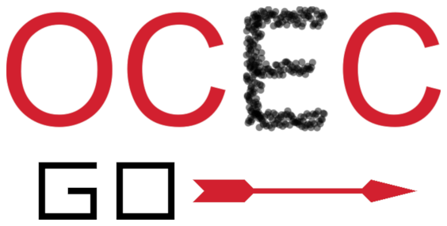

########################################################
OCECgo: A MATLAB Tool for the Sunset Model 4 Instrument
########################################################

---------------------

*OCECgo* is a MATLAB-based software tool for the quantification of uncertainties in the calibration and data analysis of the Sunset Laboratory Model 4 semi-continuous thermal-optical organic/elemental carbon analyzer.

.. toctree::
  :caption: Table of Contents
  :maxdepth: 2

  Calibration <calibration>
  Data Analysis <dataanalysis>
  Algorithm Details <algorithmdetails>

****************
Citation and Use
****************

*OCECgo* is described in an article submitted to the Journal of Visualized Experiments and is being shared free of charge under the :ref:`MIT license <AnchorToLicense>`.  When using the software for analysis of data in published work, it is requested that users cite/acknowledge the following:

  Conrad, B.M. & Johnson, M.R. (2019), Calibration protocol and software for split point analysis and uncertainty quantification of thermal-optical organic/elemental carbon measurements, **J. Vis. Exp.**, 151:e59742 (doi: `10.3791/59742 <https://doi.org/10.3791/59742>`_)

********
Features
********

.. include:: ../README.rst
  :start-after: features-start
  :end-before: features-end

************
Installation
************

*OCECgo* is available as a source distribution and a build distribution and is hosted on `GitHub <https://github.com/bradleymconrad/OCECgo>`_.  If you have a MATLAB license (R2016a or newer), add the "source" directory to the MATLAB path and run "OCECgo". Alternatively, double-click the "OCECgo_webinstaller" executable in the "build" directory to install a standalone version of the software on your computer.

To clone the *OCECgo* repository, see GitHub's `instructions <https://help.github.com/en/articles/cloning-a-repository>`_.

.. note::

  When booting the software, the landing screen may disappear and it may seem as though booting has stalled. Be patient at this point; the MATLAB runtime is being loaded and *OCECgo* will initialize shortly after.

Requirements
============

*OCECgo* was originally developed and has been tested in MATLAB R2016a and R2018b, and uses the *signal_toolbox* and *statistics_toolbox*.

If you encounter issues during installation or when using *OCECgo*, please contact the author.

**********
Contribute
**********

*OCECgo* is intended be a research tool that improves over time - your input to introduce and improve functionality would be highly appreciated! Consider contributing in the following ways:

  1. Have a bug report? Raise an issue on github.

  2. Want to introduce functionality helpful to your work/field? Fork the repository, make it work for you, and issue a pull request. Credit will always be given!

.. _AnchorToLicense:

*******
License
*******

*OCECgo* is licensed under the **MIT** license:

  .. include:: ../LICENSE.txt

**************************
Author Contact Information
**************************

You can contact Bradley (Brad) Conrad with issues and/or recommendations at brad.conrad@carleton.ca or brad.m.conrad@gmail.com

***************
Version History
***************

.. include:: ../README.rst
  :start-after: version-start
  :end-before: version-end

****************
Acknowledgements
****************

*OCECgo* was developed at Carleton University's `Energy and Emissions Research Laboratory <http://www.carleton.ca/eerl>`_ with support from `NSERC FlareNet <http://www.flarenet.ca>`_.

.. image:: images/Logo_EERL.png
   :scale: 40 %
   :align: center
   :target: http://www.carleton.ca/eerl

|

.. image:: images/Logo_FlareNet.png
   :scale: 40 %
   :align: center
   :target: http://www.flarenet.ca
